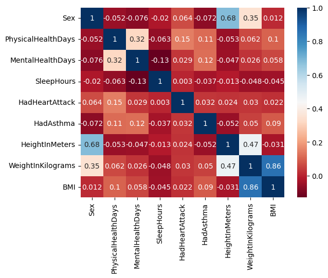
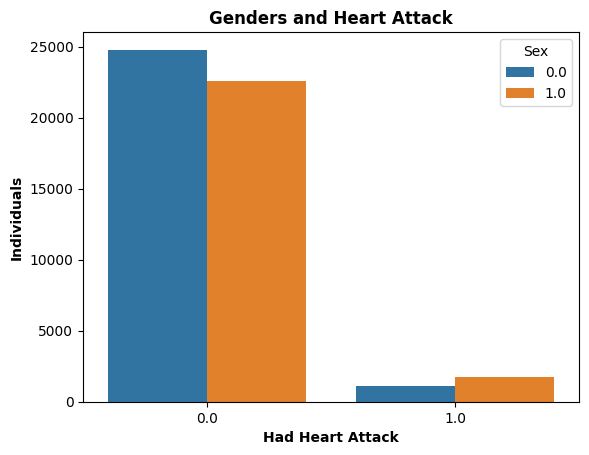
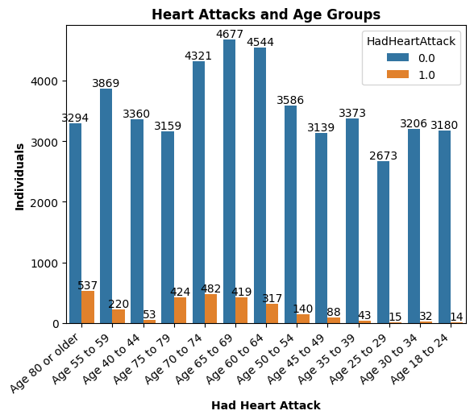
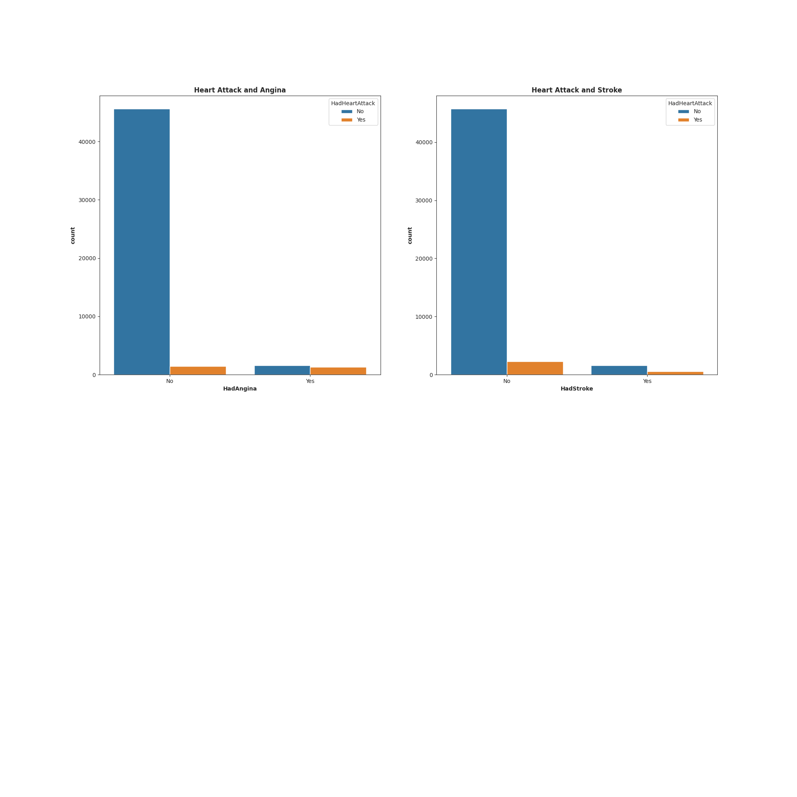

# Datamining 2024-10 Indicators of Heart Disease

Welcome to the Datamining 2024-10 project! This project aims to analyze key indicators of heart disease using data mining techniques.

## Team Members
Meet the team members working on this project:

|  | **Jesús Antonio Zuluaga Moreno** |
| --- | --- |
| *Role*: Mathematics enthusiast | *Bio*: 7th-semester mathematics student at Universidad del Norte, passionate about physics and mathematics. |

|  | **Diego Linero Ramirez** |
| --- | --- |
| *Role*: Technology enthusiast | *Bio*: 9th-semester Systems engineering student at Universidad del Norte, passionate about innovation and technology. |

|  | **María Valentina Páez Romero** |
| --- | --- |
| *Role*: Technology enthusiast | *Bio*: Systems engineering student at Universidad del Norte, passionate about technology and always ready to face new challenges. |

|  | **Sebastian Barandica Oquendo** |
| --- | --- |
| *Role*: Problem-solving enthusiast | *Bio*: 9th-semester systems engineering at Universidad del Norte,, lover of mathematics and problem-solving. |

|  | **Andrea Carolina Donado Porto** |
| --- | --- |
| *Role*: Versatile learner | *Bio*: Systems engineering student at Universidad del Norte, enjoys reading, thinking about everyday problems, and learning a little about everything, applying it to technology. |

## Rationale Behind Dataset Selection

**Heart disease** is a significant cause of mortality globally, and the dataset, sourced from the [**2022 annual CDC survey**](https://www.kaggle.com/datasets/kamilpytlak/personal-key-indicators-of-heart-disease) of **400k+ adults**, provides invaluable insights into various factors contributing to heart disease prevalence. Our intention with utilizing this dataset is to develop a predictive model that can aid in identifying individuals at risk of heart disease. This is particularly significant in regions like Colombia, where sufficient data and datasets regarding cardiovascular diseases may be lacking. In [Colombia, cardiovascular diseases are the leading cause of mortality](https://www.ncbi.nlm.nih.gov/pmc/articles/PMC4705360/), with a significant number of these events being preventable. Given the similarity in risk factors and health patterns, using the CDC dataset on key indicators of heart disease in American adults could provide valuable **insights** to inform preventive and public health strategies in Colombia. By comparing and contrasting demographic and health data between both populations, the research and recommendations could be more effectively tailored, addressing the specific needs and characteristics of the Colombian population. Furthermore, the dataset's richness is evident in its offering of **40 variables** for observation, coupled with over **400k+ samples**.

## Project Details

For more details about the project, including datasets and analysis, visit our GitHub Pages website: [Datamining 2024-10 Indicators of Heart Disease](https://AnwiiD.github.io/DataMining-Heart-Failure)

## Visual Analysis Of Key Heart Disease Indicators: Exploring the BRFSS Dataset
In our analysis, we employed various visualization techniques with the BRFSS dataset:
### Correlation Heatmap:
We created a correlation heatmap to explore relationships between different variables, particularly those related to key indicators of heart disease. This heatmap provided a quick overview of positive or negative associations among the selected variables.

### Countplot by Gender: 
We generated a countplot to visualize the distribution of heart disease cases based on gender. This type of plot allowed us to determine whether heart disease is more prevalent in males or females, offering a general perspective on the prevalence in the surveyed population.

### Age-Grouped Heart Attacks by Gender:
We grouped heart attack cases by age and gender to gain a more detailed understanding of how the incidence of heart disease varies across different demographic groups. This helped us identify potential patterns or significant differences in prevalence between males and females in different age brackets.

### Associations Among Cardiovascular Events:
Insights into Heart Attacks, Angina, and Strokes"** Additionally, we created another visualization to demonstrate that individuals experiencing heart attacks also tend to suffer from angina and strokes. This graphic provided insights into the co-occurrence of these cardiovascular events, highlighting potential common risk factors or associations within the dataset."

## Our Hypothesis
Based on key indicators of heart disease, we could assert that there is a significant relationship between the prevalence of heart disease and factors such as physical health days, sex, mental health days, sleep hours, history of heart attacks, body mass index (BMI), and pre-existing conditions such as high blood pressure, high cholesterol, smoking habits, and diabetes in the adult population surveyed in the BRFSS dataset.

Another one we want to explore is:" The number of physical health days experienced in the last 30 days is associated with an increased likelihood of having had a heart attack."

## Our Colab 
In this collaborative Google Colab notebook, we are actively processing and analyzing the key indicators of heart disease using the Behavioral Risk Factor Surveillance System (BRFSS) dataset.  **Link:** https://colab.research.google.com/drive/1Iai3o2oUkOMWRZbo2goXvb5BktcFxKcA?usp=sharing#scrollTo=wdW71kB8UVls
