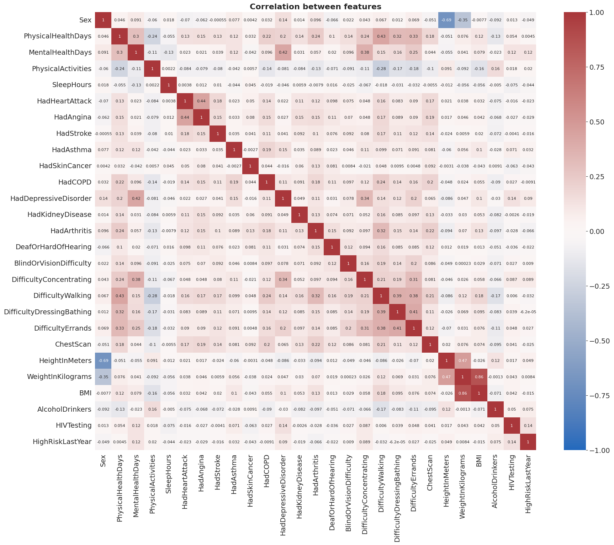
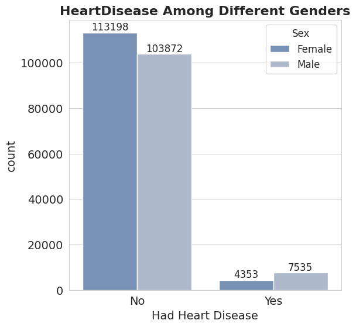
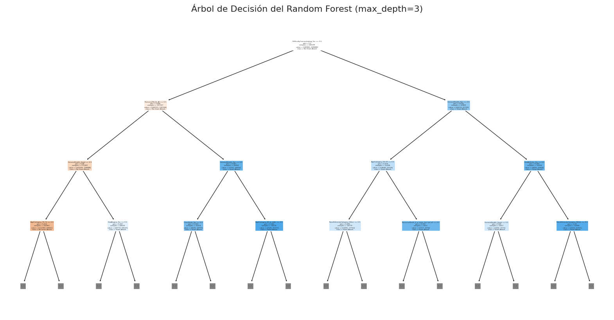
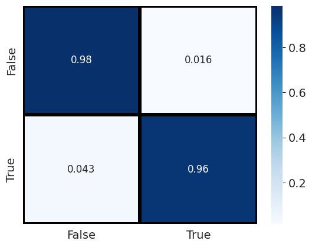

# Datamining 2024-10 Indicators of Heart Disease

Welcome to the Datamining 2024-10 project! This project aims to analyze key indicators of heart disease using data mining techniques.

## Team Members
Meet the team members working on this project:

|  | **Jesús Antonio Zuluaga Moreno** |
| --- | --- |
| *Role*: Mathematics enthusiast | *Bio*: 7th-semester mathematics student at Universidad del Norte, passionate about physics and mathematics. |

|  | **Diego Linero Ramirez** |
| --- | --- |
| *Role*: Technology enthusiast | *Bio*: 9th-semester Systems engineering student at Universidad del Norte, passionate about innovation and technology. |

|  | **María Valentina Páez Romero** |
| --- | --- |
| *Role*: Technology enthusiast | *Bio*: Systems engineering student at Universidad del Norte, passionate about technology and always ready to face new challenges. |

|  | **Sebastian Barandica Oquendo** |
| --- | --- |
| *Role*: Problem-solving enthusiast | *Bio*: 9th-semester systems engineering at Universidad del Norte,, lover of mathematics and problem-solving. |

|  | **Andrea Carolina Donado Porto** |
| --- | --- |
| *Role*: Versatile learner | *Bio*: Systems engineering student at Universidad del Norte, enjoys reading, thinking about everyday problems, and learning a little about everything, applying it to technology. |

## Rationale Behind Dataset Selection

**Heart disease** is a significant cause of mortality globally, and the dataset, sourced from the [**2022 annual CDC survey**](https://www.kaggle.com/datasets/kamilpytlak/personal-key-indicators-of-heart-disease) of **400k+ adults**, provides invaluable insights into various factors contributing to heart disease prevalence. Our intention with utilizing this dataset is to develop a predictive model that can aid in identifying individuals at risk of heart disease. This is particularly significant in regions like Colombia, where sufficient data and datasets regarding cardiovascular diseases may be lacking. In [Colombia, cardiovascular diseases are the leading cause of mortality](https://www.ncbi.nlm.nih.gov/pmc/articles/PMC4705360/), with a significant number of these events being preventable. Given the similarity in risk factors and health patterns, using the CDC dataset on key indicators of heart disease in American adults could provide valuable **insights** to inform preventive and public health strategies in Colombia. By comparing and contrasting demographic and health data between both populations, the research and recommendations could be more effectively tailored, addressing the specific needs and characteristics of the Colombian population. Furthermore, the dataset's richness is evident in its offering of **40 variables** for observation, coupled with over **400k+ samples**.

## Visual Analysis Of Key Heart Disease Indicators: Exploring the BRFSS Dataset
In our analysis, we employed various visualization techniques with the BRFSS dataset:
### Correlation Heatmap:
We created a correlation heatmap to explore relationships between different variables, particularly those related to key indicators of heart disease. This heatmap provided a quick overview of positive or negative associations among the selected variables.

### Countplot by Gender: 
We generated a countplot to visualize the distribution of heart disease cases based on gender. This type of plot allowed us to determine whether heart disease is more prevalent in males or females, offering a general perspective on the prevalence in the surveyed population.

### Age-Grouped Heart Attacks by Gender:
We grouped heart attack cases by age and gender to gain a more detailed understanding of how the incidence of heart disease varies across different demographic groups. This helped us identify potential patterns or significant differences in prevalence between males and females in different age brackets.

### Associations Among Cardiovascular Events:Insights into Heart Attacks, Angina, and Strokes" 
Additionally, we created another visualization to demonstrate that individuals experiencing heart attacks also tend to suffer from angina and strokes. This graphic provided insights into the co-occurrence of these cardiovascular events, highlighting potential common risk factors or associations within the dataset."

## Introduction

Understanding the complex relationship between various factors and the prevalence of heart disease is crucial for effective prevention and management strategies. In this context, our hypothesis aims to explore the significant associations between key indicators of heart disease and various demographic and health-related factors. Specifically, we focus on factors such as physical health days, sex, mental health days, sleep hours, history of heart attacks, body mass index (BMI), and pre-existing conditions including high blood pressure, high cholesterol, smoking habits, and diabetes. By analyzing data from the BRFSS dataset, we seek to uncover patterns and correlations that shed light on the interplay between these variables and the likelihood of heart disease in the adult population.

## Our Hypothesis

Our hypothesis posits that there exists a notable correlation between the prevalence of heart disease and the aforementioned factors within the adult population surveyed in the BRFSS dataset. We anticipate that factors such as physical health days, sex, mental health days, sleep hours, history of heart attacks, BMI, and pre-existing conditions will exhibit significant associations with the likelihood of heart disease. Additionally, we aim to investigate the specific relationship between the number of physical health days experienced in the last 30 days and the likelihood of having had a heart attack. By examining these relationships, we aim to contribute valuable insights into the understanding and prevention of heart disease.

# Model Selection 1: Random Forest Classifier
## Objectives for estimation
<ul>
  <li>Test the hypothesis that there is a significant relationship between the prevalence of heart disease and the selected factors in the adult population.</li>
  <li>Use random forest classifier to estimate the strength of association between these indicators and the likelihood of having heart disease.</li>
  <li>Assess the performance of the random forest classifier utilizing the BRFSS dataset to identify individuals at risk of heart disease, targeting a minimum accuracy of 0.9741.</li>
</ul>

## Details about model selection
Whe choose Random for our first model selection. 
Firstly, its ability to mitigate overfitting surpasses that of individual decision trees, crucial for ensuring our model's generalization to unseen data. 
Additionally, given the imbalanced nature of our dataset, where instances of individuals with and without heart disease may vary significantly, random forest's equitable treatment of each class during training enhances its predictive accuracy. 
With over 30 input variables, random forest adeptly handles high-dimensional data without necessitating dimensionality reduction techniques.
Lastly, its robustness to outliers and missing values further reinforces its suitability for our analysis, ensuring reliable predictions even in the presence of data imperfections. 
# Hyperparameter
We choose a random state of 42  and also limited the max_depth to 3 for visualisation purpose.
# Preprocessing and visualisation
<pre>
<code>

import pandas as pd
from sklearn.ensemble import RandomForestClassifier
from sklearn.model_selection import train_test_split
from sklearn.metrics import accuracy_score, precision_score, recall_score, f1_score, confusion_matrix
import matplotlib.pyplot as plt
import seaborn as sns

X = heart_df.drop(columns=['HadHeartAttack_Yes'])
y = heart_df['HadHeartAttack_Yes']

X_train, X_test, y_train, y_test = train_test_split(X, y, test_size=0.3, random_state=87)

rf_model = RandomForestClassifier(n_estimators=200, random_state=2002)
rf_model.fit(X_train, y_train)

y_pred = rf_model.predict(X_test)

accuracy = accuracy_score(y_test, y_pred)
precision = precision_score(y_test, y_pred)
recall = recall_score(y_test, y_pred)
f1 = f1_score(y_test, y_pred)

print("Accuracy del modelo Random Forest:", accuracy)
print("Precision del modelo Random Forest:", precision)
print("Recall del modelo Random Forest:", recall)
print("F1 Score del modelo Random Forest:", f1)

conf_matrix = confusion_matrix(y_test, y_pred)

plt.figure(figsize=(10, 7))
sns.heatmap(conf_matrix, annot=True, fmt="d", cmap="Blues", xticklabels=['No Heart Attack', 'Heart Attack'], yticklabels=['No Heart Attack', 'Heart Attack'])
plt.xlabel('Predicted')
plt.ylabel('Actual')
plt.title('Matriz de Confusión')
plt.show()

</code>
</pre>
It starts with data preprocessing, including handling categorical variables through one-hot encoding and encoding target labels to numeric values. The dataset is then split into training and testing sets. Afterward, a pipeline is constructed, incorporating data preprocessing steps and the Random Forest classifier. The model is trained on the training data and evaluated on the test data, with accuracy as the metric. 

## Validation methods and the metrics employed.
<pre>
  <code>
print("Accuracy del modelo Random Forest:", accuracy)
print("Precision del modelo Random Forest:", precision)
print("Recall del modelo Random Forest:", recall)
print("F1 Score del modelo Random Forest:", f1)

conf_matrix = confusion_matrix(y_test, y_pred)

plt.figure(figsize=(10, 7))
sns.heatmap(conf_matrix, annot=True, fmt="d", cmap="Blues", xticklabels=['No Heart Attack', 'Heart Attack'], yticklabels=['No Heart Attack', 'Heart Attack'])
plt.xlabel('Predicted')
plt.ylabel('Actual')
plt.title('Matriz de Confusión')
plt.show()
  </code>
</pre>
Accuracy del modelo Random Forest: 0.9740852441294079

Precision del modelo Random Forest: 0.9719628449717431

Recall del modelo Random Forest: 0.9764322150284481

F1 Score del modelo Random Forest: 0.9741924039173228

In this project, we employed cross-validation, a technique used to assess the performance of a model and avoid overfitting. We also ensured proper handling of both categorical and numerical columns during preprocessing to optimize model training. 

# Model Selection 2: Logistic Regression Classifier
## Objectives for estimation
<ul>
  <li>Test the hypothesis that there is a significant relationship between the prevalence of heart disease and the selected factors in the adult population.</li>
  <li>Use logistic regression to estimate the strength of association between these indicators and the likelihood of having heart disease.</li>
  <li>Assess the performance of the logistic regression model utilizing the BRFSS dataset to identify individuals at risk of heart disease, targeting a minimum accuracy of 0.9707.</li>
</ul>

## Details about model selection

We chose Logistic Regression for our model selection due to its simplicity and interpretability. Logistic Regression provides a clear understanding of the relationship between the input features and the target variable, which is crucial for medical data where interpretability is important. Additionally, it is efficient to train and performs well on smaller datasets, making it suitable for our data. Logistic Regression also handles imbalanced datasets effectively by providing probabilistic predictions, which can be adjusted to different threshold levels to improve sensitivity or specificity as needed.

## Hyperparameters
We chose a random state of 42 and set the maximum number of iterations to 2000 to ensure convergence.

## Preprocessing and visualization
<pre>
<code>

import pandas as pd
from sklearn.linear_model import LogisticRegression
from sklearn.model_selection import train_test_split
from sklearn.metrics import accuracy_score, precision_score, recall_score, f1_score, confusion_matrix
from sklearn.preprocessing import StandardScaler
import matplotlib.pyplot as plt
import seaborn as sns

X = heart_df.drop(columns=['HadHeartAttack_Yes'])
y = heart_df['HadHeartAttack_Yes']

X_train, X_test, y_train, y_test = train_test_split(X, y, test_size=0.3, random_state=87)

scaler = StandardScaler()
X_train = scaler.fit_transform(X_train)
X_test = scaler.transform(X_test)

logreg_model = LogisticRegression(max_iter=2000, random_state=2002)
logreg_model.fit(X_train, y_train)

y_pred = logreg_model.predict(X_test)

accuracy = accuracy_score(y_test, y_pred)
precision = precision_score(y_test, y_pred)
recall = recall_score(y_test, y_pred)
f1 = f1_score(y_test, y_pred)

print("Accuracy del modelo de Regresión Logística:", accuracy)
print("Precisión del modelo de Regresión Logística:", precision)
print("Recall del modelo de Regresión Logística:", recall)
print("F1 Score del modelo de Regresión Logística:", f1)

conf_matrix = confusion_matrix(y_test, y_pred)

plt.figure(figsize=(10, 7))
sns.heatmap(conf_matrix, annot=True, fmt="d", cmap="Blues", xticklabels=['No Heart Attack', 'Heart Attack'], yticklabels=['No Heart Attack', 'Heart Attack'])
plt.xlabel('Predicted')
plt.ylabel('Actual')
plt.title('Matriz de Confusión')
plt.show()

</code>
</pre>
It starts with data preprocessing, including standardizing numerical variables and encoding target labels to numeric values. The dataset is then split into training and testing sets. Afterward, a pipeline is constructed, incorporating data preprocessing steps and the Logistic Regression classifier. The model is trained on the training data and evaluated on the test data, with accuracy as the metric.

## Validation methods and the metrics employed

<pre>
  <code>
print("Accuracy del modelo de Regresión Logística:", accuracy)
print("Precisión del modelo de Regresión Logística:", precision)
print("Recall del modelo de Regresión Logística:", recall)
print("F1 Score del modelo de Regresión Logística:", f1)

conf_matrix = confusion_matrix(y_test, y_pred)

plt.figure(figsize=(10, 7))
sns.heatmap(conf_matrix, annot=True, fmt="d", cmap="Blues", xticklabels=['No Heart Attack', 'Heart Attack'], yticklabels=['No Heart Attack', 'Heart Attack'])
plt.xlabel('Predicted')
plt.ylabel('Actual')
plt.title('Matriz de Confusión')
plt.show()
  </code>
</pre>
Accuracy del modelo de Regresión Logística: 0.9706823584331984

Precisión del modelo de Regresión Logística: 0.9835375914753189

Recall del modelo de Regresión Logística: 0.9574995095154012

F1 Score del modelo de Regresión Logística: 0.9703439063033955

In this project, we employed cross-validation, a technique used to assess the performance of a model and avoid overfitting. We also ensured proper handling of both categorical and numerical columns during preprocessing to optimize model training.

## Conclusions

Both the Random Forest and Logistic Regression models demonstrate excellent performance in predicting heart attacks, achieving high accuracy, precision, recall, and F1 scores. The Random Forest model, with an accuracy of 97.41%, a precision of 97.20%, and a recall of 97.64%, excels in correctly identifying positive cases of heart attacks. This makes it particularly effective at minimizing false negatives, ensuring that most actual heart attack cases are detected. This model is ideal when the priority is to avoid missing any potential heart attack cases, thus providing a more comprehensive screening tool.

On the other hand, the Logistic Regression model, with an accuracy of 97.07%, a precision of 98.35%, and a recall of 95.75%, offers slightly better precision. This model is more effective at reducing the number of false positives, meaning it is more reliable at predicting heart attacks only when they are very likely to occur. This makes it preferable in scenarios where it is crucial to minimize the number of incorrect heart attack predictions, thereby reducing unnecessary stress and medical interventions for patients.

In summary, while both models are highly effective at predicting heart attacks, the choice between them should be guided by whether the primary goal is to maximize the detection of true positive cases (favoring the Random Forest) or to minimize false positive predictions (favoring Logistic Regression).

## Our Colab 
In this collaborative Google Colab notebook, we are actively processing and analyzing the key indicators of heart disease using the Behavioral Risk Factor Surveillance System (BRFSS) dataset.  
#### Link: [Colab](https://colab.research.google.com/drive/1oqJ3N0Pkx_IKPrnkxjWtKydzer5bo5US?usp=sharing)
